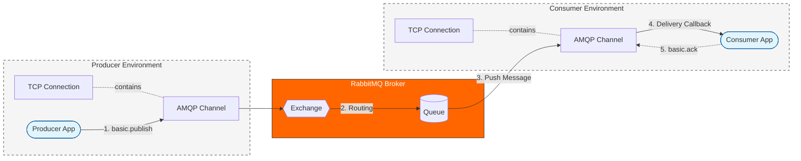

# Queues

## Dead Letter

In case of **Kafka**

- It does **nothing automatically**
- Catch error
- Produce message to topic.DLQ

In case of **RabbitMQ:**

- It is both **consumer + broker**
- Consumer:
  - `NACK` + `requeue=false` - message does into DLQ
- Broker:
  - Message expired (TTL)
  - Queue length exceeded

## Metrics for brokers

Brokers expose metrics **themselves**

**Kafka typical metrics:**

- watch if disk is full
- under-replicated partitions
- broker restarts
- consumer lag

Exported via: `JMX Exporter -> Prometheus -> Grafana`

**RabbitMQ exposes:**

- Ack rate
- Publish rate
- Unacked messages
- and more...

Exported via: `Built-in Prometheus plugin`

## RabbitMQ

> **AMQP** - Advanced Message Queuing Protocol. Built **on top of TCP**.

**RabbitMQ** is a message broker that offers a flexible and reliable system for transmitting messages between systems.  
It supports the **AMQP protocol**.

**Distributed task processing** - meaning that distributed system processes messages by **publisher confirmations** that
RabbitMQ got the message and **consumer acknowledgements** that consumer got and processed the message.

`ack` - message processed
`nack` - message failed

### RabbitMQ Core Entities

- **Exchange**  
  Think of an exchange like a post office sorter: it receives every incoming message and, based on rules, decides which queue(s) should get it.

- **Queue**  
  A queue is like your home mailbox: messages sit here until a consumer (you) comes by and picks them up.

- **Binding**  
  A binding is the address label that links an exchange to a queue. It tells the exchange, “If a message matches this pattern, deliver it to that queue.”

- **Virtual Host (vhost)**  
  A virtual host is like an apartment building with separate mailrooms: it provides isolated namespaces so multiple apps can use the same RabbitMQ server without stepping on each other’s messages.

- **Connection**  
  A connection is the TCP “phone line” between your application and the RabbitMQ broker. You usually open one per application instance.

- **Channel**  
  A channel is like an individual phone call on that line: it’s a lightweight, multiplexed session over a single connection. Best practice is to do most operations over channels rather than opening many connections.

- **Message**  
  The actual letter you send: it carries a payload (body) and optional metadata (headers, routing key, TTL). Exchanges and queues handle messages.

**Quorum Queue** - A replicated queue where messages are written to a majority of nodes before ACK. **Majority must confirm** writes. Safer, slower

### 🧭 RabbitMQ Workflow

- `assertExchange` → create exchange
- `assertQueue` → create queue
- `publish` → send message to exchange with a routing key
- `consume` → listen to messages from queue

`amqplib` - node js package for rabbitmq



### 🧭 Exchange Types

**Direct** - (Default one) Routes to queue based on exact match on `routingKey`

**Topic** - Pattern match.  
Better using an example:

- `*` - exactly one word
- `#` - zero or more words
  Given a published message with a routing key: `iphone.17.black`

1. `iphone.*.black` → match (\* matches "17")
2. `iphone.#` → match (# matches "17.black")
3. `samsung.#` → mismatch (different first word)

**Fanout** - Broadcast to all queues. Ignore the routing key.

**Headers** Match on custom headers instead of keys

> 💡 `iphone.*.black` is called binding pattern

### 🔁 Message Ordering

- ❌ **No by default**
- Messages in a **single queue** are delivered in order
- To ensure order: use **"one queue per consumer"** pattern. Each consumer processes messages from it's own queue

### 📡 Channels in RabbitMQ

**Channels** are virtual connections inside a single TCP connection to the RabbitMQ.

- Created and managed using the AMQP protocol.
- Multiple channels can be opened per connection.
- Used to isolate different operations (e.g., publishing vs consuming) in the same connection.
- Lightweight and fast – avoids the overhead of opening multiple TCP connections.

> ⚠️ It's important to never share a channel between producers and consumers. Always create separate channels for each logical responsibility.

### 💾 Durable Messaging

| Option                                 | Behavior                        |
| -------------------------------------- | ------------------------------- |
| `deliveryMode: 1`                      | Non-persistent queue            |
| `deliveryMode: 2`                      | Message survives broker restart |
| `assertQueue(..., { durable: true })`  | Queue survives broker restart   |
| `assertQueue(..., { durable: false })` | Temporary queue                 |

> Durable messages `deliveryMode: 2` require durable queue to matter

### ✅ Acknowledgements

- **Manual ack**: `channel.ack(msg)`

  - Used for `at-least-once`
  - Use for **critical operations** (e.g. orders, payments). Do the operation, then acknowledge
  - Set with: `{ noAck: false }` in `channel.consume(...)`

- **Auto ack**: `{ noAck: true }`
  - Used for `at-most-once`
  - Use for **non-critical data** (e.g. logs, metrics)
  - Message is treated as handled immediately upon delivery

### ⏱️ Delayed Retries (Plugin)

What if microservice is dead, message **fails to be acknowledged** and **infinitely keeps trying** ?

Use the community plugin `rabbitmq_delayed_message_exchange` to retry messages with a delay.

- Enable on the broker: `rabbitmq-plugins enable rabbitmq_delayed_message_exchange`.
- Declare an exchange of type `x-delayed-message` with argument `x-delayed-type` (e.g., `direct`).
- Publish with header `x-delay` in milliseconds. Broker delivers after the delay.

**Tiny Example**

```js
const ch = await conn.createChannel();
await ch.assertExchange("retry-ex", "x-delayed-message", {
  durable: true,
  arguments: { "x-delayed-type": "direct" },
});
await ch.assertQueue("jobs", { durable: true });
await ch.bindQueue("jobs", "retry-ex", "jobs");

// publish with 5s delay
ch.publish("retry-ex", "jobs", Buffer.from(JSON.stringify({ id: 1 })), {
  headers: { "x-delay": 5000 },
  persistent: true,
});
```

## Kafka

- **Producer** writes messages. May be idempotent that does not write duplicate messages
- **Broker** - Kafka itself is dumb broker that ONLY stores and deliveres messages. Nothing more
  - **Topic** - Named stream of messages
  - **Partition** - Each topic is split into partitions. Messages in partitions are in order. **Leader** + **Replicas**
- **Consumer** (or Consumer Group) - one (ones) who **requests and reads** messages. Handles all logic

### Common problems with it

- disk is full
- too few partitions e.g. 3 partitions, 10 consumers, - **7 of those do nothing**
- **under-replication** - partition leader has `1000` offset, replicas have `900`. If leader dies, we loose data.
  (mostly DevOps problem, just know it exists)

### Avro format

Native message format to kafka. **Used very heavily**

- Binary
- Schema stored separately
- Supports **schema evolution**

**Key feature**

- Consumer can **read old messages** with new schema

### Kafka offset

**offset** - sequentian number of a message inside partition. Not id, **just position number**.

> 💡 **offset != message ID** - offset 42 today and tomorrow are different messages. Kafka deletes old messages, you may use compact topic (latest messages).

```sql
Topic: payments
 ├── Partition 0:  offset 0 1 2 3 4 ... --> consuemr 1
 ├── Partition 1:  offset 0 1 2 3 4 ... --> consumer 2
 └── Partition 2:  offset 0 1 2 3 4 ... --> consumer 3
```

> 💡 **One consumer** corresponds to **one partition**. Otherwise some consumers do nothing or consumers read multiple partitions.

> 💡 To scale a number of consumers you need **more partitions**

### Consumer lag

**Exampl:e**

- Latest offset in partition = 1000
- Consumer offset = 900
- Lag = 100 messages

Higher lag == slower consumer. Can indicate **bugs**, **overload**, or **downstream failures**

### Delivery guarantees

**Producer side**

- `acks=0` → at-most-once (fast, unsafe)
- `acks=all` + retries → at-least-once
- `enable.idempotence=true` → no duplicates from retries

**Consumer side**

- Auto-commit offset → risk message loss
- Manual commit after processing → safe

**Best practice**

```
read message
process message
commit offset
```

## Transactions in brokers

- **Requires** Idempotent producer (identify duplicate messages), Transactional ID (identify same producer identity)
- Only **message delivery guarantees**

**Not used in RabbitMQ**. Instead ACK + retries used there

**Mostly** used in kafka like so

```
Read from topic A → write to topic B → commit offset
All or nothing.
```

## 🗃️ RabbitMQ vs Kafka Persistence

**RabbitMQ**:

- Messages can be persisted with:
- `channel.assertQueue('q', { durable: true })`
- `channel.sendToQueue('q', Buffer.from(msg), { deliveryMode: 2 })`
- ❌ **Messages are deleted after delivery**
- Designed for **message passing**, not long-term storage

**Example:** Multiple workers consume tasks.

- Stores messages on disk for a **configurable retention period**
- ✅ Consumers can **re-read** messages multiple times "Replayability"
- Designed for **event streaming** and **log storage**.

**Example:** Frontend sends events to analytics.

## 🧱 Role of Queues in Server Architecture

1. **Load Balancing Among Handlers**

   - Distribute tasks across multiple workers
   - Add more consumers to scale under high load

2. **Message Buffering for Resilience**

   - Queue stores incoming messages if handlers are slow/unavailable
   - Prevents message loss during spikes or failures

3. **Ordered & Reliable Processing**

   - Ensures messages are processed **in the order sent**
   - Combined with **acknowledgements**, guarantees reliability

## Smart broker dumb consumer

- `RabbitMQ` is smart broker
- In `RabbitMQ` the **broker (server)** manages all the logic for delivery, routing, and ordering of messages
- **Consumer (client)** only processes and acknowledgments messages.
- **Simplifies client code**, **reduces the load** on the consumer.

## 📬 Delivery Guarantees

- **At-least-once**
  - Broker keeps trying until it gets an ack. Requeue if consumer crashes
  - Use with manual acknowledgements and idempotent handlers.
  - _Example_: order service rechecks "charge already done?" before charging again.
- **At-most-once**
  - Message is delivered zero or one time. If consumer dies mid-work, message is gone.
  - Use with auto ack when losing a message is acceptable.
  - _Example_: analytics counter for user action.
- **Exactly-once**
  - Goal: handle a message _just one time_, even if retries happen under the hood.
  - Combine _at-least-once_ delivery with idempotency.
  - _Example_: billing worker checks db for matching `idempotency key` or `transaction id`. Is this message processed already ?

## ⚔️ RabbitMQ vs Kafka

> 💡 Kafka **topic** (which you might think of as “a queue”) is split into multiple **partitions** for scalability and parallelism.

| Feature             | RabbitMQ                                                                                                                                                                                                | Kafka                                                                                                                                |
| :------------------ | :------------------------------------------------------------------------------------------------------------------------------------------------------------------------------------------------------ | :----------------------------------------------------------------------------------------------------------------------------------- |
| **Broker Type**     | **Smart Broker**: message routing, queuing, delivery logic (**pushes messages** to consumers).                                                                                                          | **Dumb Broker (Log-based)**: Simple, immutable log of messages. **Consumers pull messages** and manage their own state (offsets).    |
| **Persistence**     | Messages are typically **deleted after delivery/acknowledgment**. Durability options (durable queues, durable messages) ensure survival of broker restarts, but not long-term storage or replayability. | All messages are **persisted to disk** in an immutable log for a configurable retention period. Supports re-reading messages.        |
| **Delivery**        | **At-Least-Once** (with acknowledgments) by default. At-most-once (by disabling acks). Exactly-once is complex and requires application-level logic.                                                    | **At-Least-Once** by default. Exactly-once achievable with Kafka Transactions. At-most-once by committing offsets before processing. |
| **Message Routing** | **Rich routing capabilities** via various Exchange types (Direct, Topic, Fanout, Headers). Built-in Fanout Exchange for broadcast.                                                                      | Primarily **topic-based partitioning**. Fanout/broadcast achieved by multiple consumer groups subscribing to the same topic.         |
| **Use Case**        | small messages, **complex routing logic**                                                                                                                                                               | **Event streaming**, log aggregation, real-time analytics, **high throughput**                                                       |

## Backpressure

System **can't keep up**, too many messages, need to slow down

- **Kafka** - consumer just asks for less messages in a batch or asks less frequently, lag increases, but nothing critical
- **RabbitMQ** - broker pushes messages, if consumer is slow, system can carsh. Solution is `prefetch = N` param so that we set how much consumer can handle.

## 1 million messages broker question

Choose **Kafka** because it is built for this

- Many partitions (e.g. 50–100)
- Consumer groups scaled easily
- Batch processing
- Compression enabled
- Proper keying
